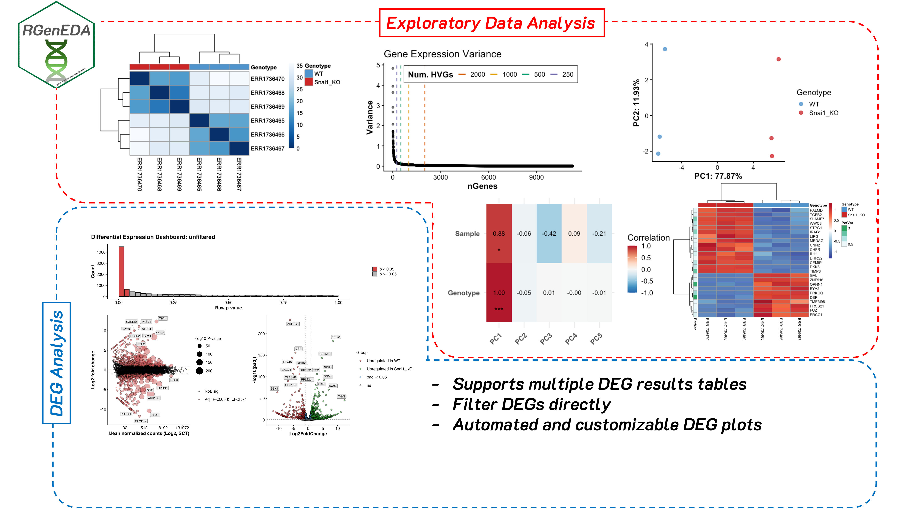
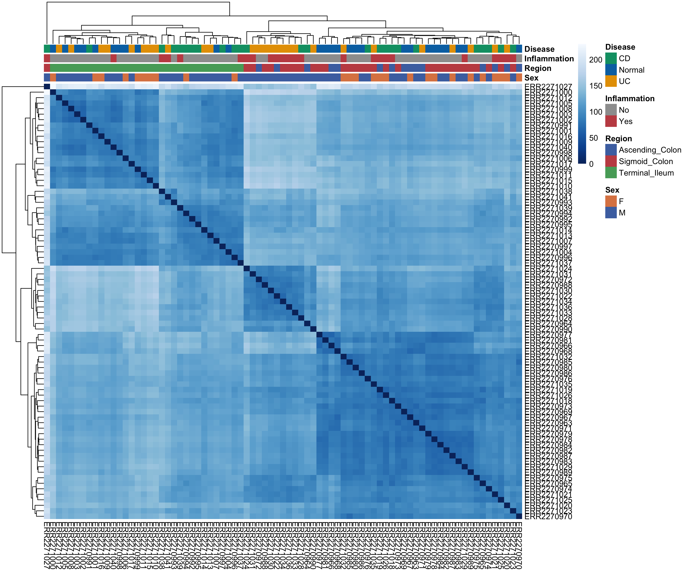
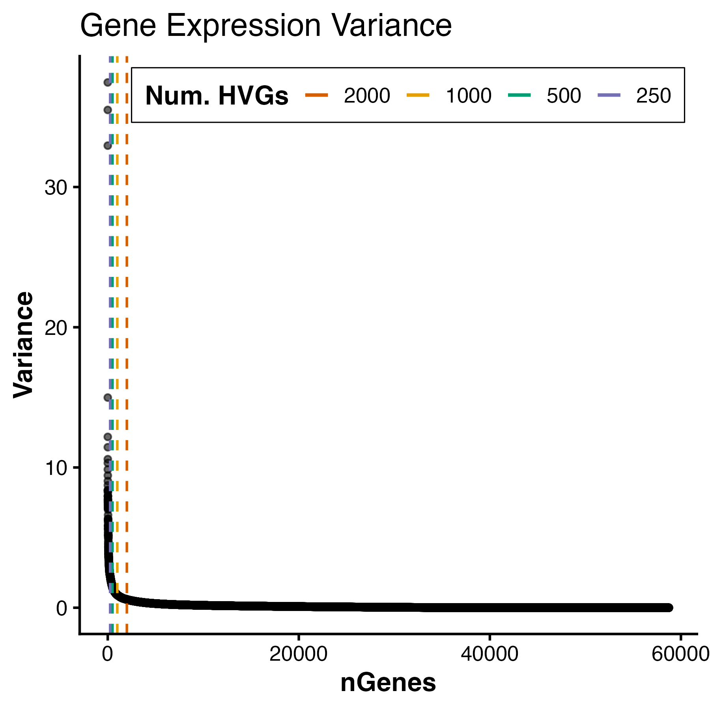
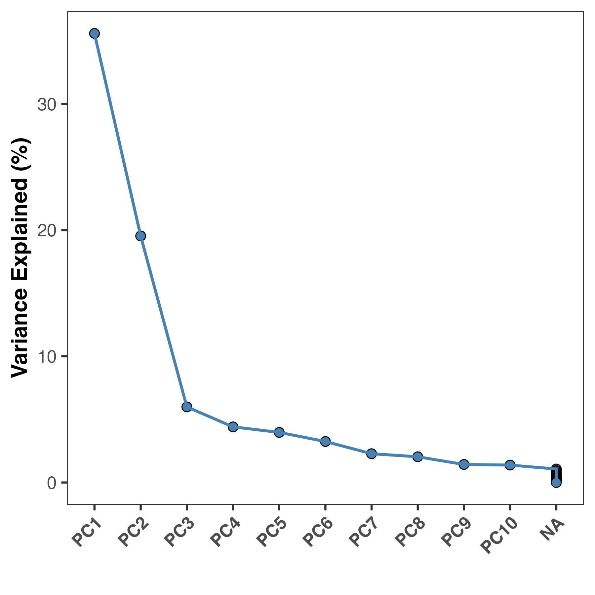
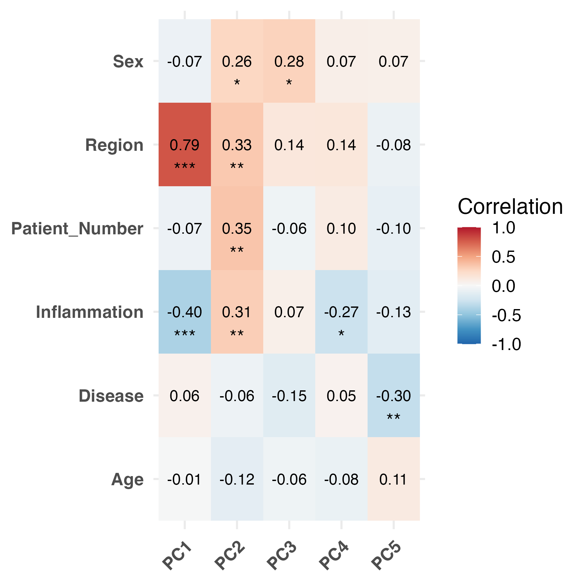
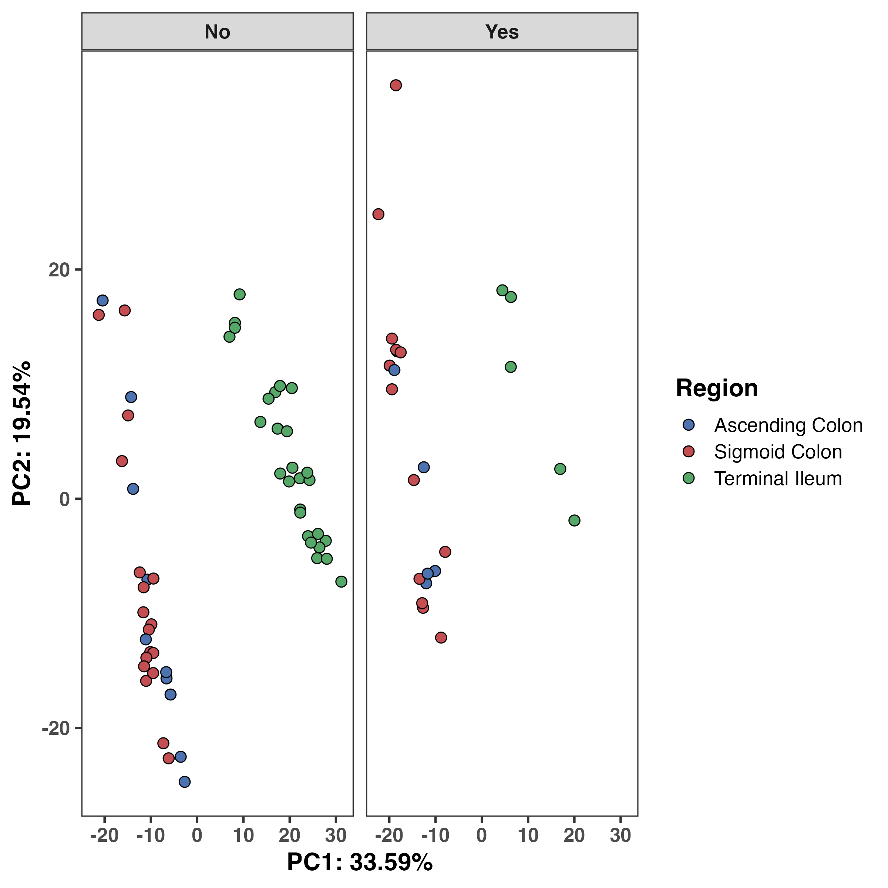

## TL;DR

Exploratory data analysis (EDA) helps you understand *what is driving variation* in your data *before* formal modeling. I developed `RGenEDA` to sit between raw preprocessing and formal modeling; helping to provide a structured, reproducible framework for performing data exploration and QC analyses in R, making your work efficient, interpretable, and backed by quantitative metrics. 

**Disclaimer** this is *not* a comprehensive analysis nor a comprehensive vignette of the capabilities of `RGenEDA`.




## What is exploratory data analysis

One of the major pitfalls that early career bioinformaticians and bench biologists face during a computational analysis is jumping straight to a formal analysis (often blindly following a tool's vignette), then feeling stumped when the results are underwhelming, or make no biological sense. often, a vignette will show a best-case scenario, or overly simplified data, and this is fine for the purposes of learning. However, real world data is rarely that Jumping straight into a downstream analysis with untested assumptions is a fast track to confusion, spurious results, and biological stories that don’t quite add up.

Sitting between raw preprocessing and formal modeling is a step that is often underutilized (or sometimes overlooked entirely...yikes.) Before jumping straight into differential expression, GSEA, or other more complex analyses, you should assess the quality and interpretability of your data. Doing this at an early stage is powerful and can greatly inform downstream decisions. This step is known as **exploratory data analysis (EDA)**. EDA can be broadly defined as the process of systematically and mathematically examining high-dimensional biological data to understand its structure, quality, and major sources of variation (technical, biological, or both) before applying downstream modeling procedures or hypothesis testing. It is not a single analysis, but rather a suite of techniques and metrics used to assess your data.

EDA helps you answer some very important questions early on such as:

- *Is my data technically sound? Do replicates look like one another? Is there a batch effect?*

- *What (if any) technical factors drive variation in the data? Do my samples separate by sequencing depth instead of biology?*

- *Are there outliers, or confounding variables in the data? Are there any potential interactions between variables that should be considered?*

Skipping EDA can often lead to downstream models that are *technically* correct, but biologically uninformed or misleading. 

## Why I developed RGenEDA

Personally, when I started out, I found myself constantly re-writing the same code to explore my data, often code to generate a principal component plot (more on this later). I see it all too often in other people's code too. The problem was that I was usually focused on *one* analysis and when the results were confusing, I had no structured way to explore *why*. This often led to complications downstream and *ad hoc* scripts to try and slice the data different ways. I got sick of copy and pasting the same code, and feeling lost in a sea of uncertainty. 

When I joined the Genomic Data Science Core at Dartmouth, suddenly I had multiple datasets in my hands, all with wildly different designs and covariates. I started writing standalone functions initially for *me* to use to avoid repetition in my code. When my coworkers found them useful and started applying them in their projects, I decided to go deeper. I developed [`RGenEDA`](https://github.com/mikemartinez99/RGenEDA) with a single guiding principle: *lowering the barrier to effective genomic exploratory data analysis.* The package emphasizes *usability* by centering analyses around a unified S4 object (the `GenEDA` object) that encapsulates normalized data, metadata, and dimensionality reduction results. 

`RGenEDA` addresses these issues I mentioned directly by enforcing a structured and almost step-wise framework for EDA *without* sacrificing flexibility. This helps users establish a coherent analysis progression, reason about sources of variation in their data more easily, and make informed downstream decisions without losing analytical rigor. 

Note: The package and `GenEDA` object also support analysis of differential expression results. For the purpose of this blog we won't cover this, but I highly recommend checking out the [vignette](https://mikemartinez99.github.io/RGenEDA/articles/Snail1_Vignette.html#create-a-geneda-object). If you think this package will help you, feel free to install it and give it a go!


## Real World Example: Bulk Transcriptomics

In this section, we will explore how I normally use `RGenEDA` for a transcriptomics analysis by working through bulk RNA-seq data from the publication [DNA Methylation and Transcription Patterns in Intestinal Epithelial Cells from Pediatric Patients with Inflammatory Bowel Diseases Differentiate Subtypes and Associate With Outcome](https://europepmc.org/article/MED/29031501) (Howell et al., 2017.)

RNA count matrices and metadata were obtained from The Gene Expression Atlas under accession [ENA: ERP106487, E-MTAB-5464](https://www.ebi.ac.uk/gxa/experiments/E-MTAB-5464/Downloads). These data consists of 236 intestinal epithelial biopsies (3 per patient) from the terminal ileum, ascending, and sigmoid colons from children with diagnosed IBD (Crohn's (CD): n = 43, ulcerative colitis (UC): n = 23, and no IBD (Control): n = 30). The multi-region sampling design makes this dataset particularly nice for demonstrating how EDA can uncover dominant biological structure early on.

## Building a GenEDA Object

A bare-minimum `GenEDA` object contains *normalized* counts and an associated metadata table. Typically, I will take my data through [`DESeq2`](https://bioconductor.org/packages/devel/bioc/vignettes/DESeq2/inst/doc/DESeq2.html) (not with the intent of getting my model design perfect or to extract differentially expressed genes), to apply either regularized log transformtion (`rlog`), or variance stabilizing transform (`vst`). Why is this necessary? Raw RNA-Sequencing counts have a strong mean-variance relationship. This means that **counts are not comparable across genes**. High-count genes will have much higher variance than low-count genes. Since variance is dependent on the mean, lowly expressed genes are extremely noisy, while highly expressed genes disproportionately influence distance-based metrics used in EDA.

Both `rlog` and `vst` aim to stabilize variance across expression levels and make the data roughly homoskedastic (make the variance more or less constant across the range of expression values.) It is also important to note that `rlog` and `vst` transformed values incorporate the size factors calculated for `DESeq2` library size normalization, therefore making the transformed values comparable across samples. In practice, I typically use `vst` for large datasets encompassing hundreds of samples, where its speed dominates. However, the majority of my projects are smaller, so `rlog` shines due to its additional shrinkage procedures for lowly expressed genes. This can improve interpretability greatly. 

This blog assumes familiarity with generating a `DESeq2` object so we will skip this step. If you are interested to see the code, the analysis is on [GitHub](https://github.com/mikemartinez99/Howell-EDA-Example).

Creating a `GenEDA` object is straightforward and can be executed in a single command:

```R

obj <- GenEDA(
    normalized = assay(rld),
    metadata = metadata)

```

## Getting a feel for the structure of your data

To gain a sense of how your samples look compared to one another based on metadata, you can examine a heatmap of **Euclidean distances** which help you visualize sample-to-sample dissimilarity. Because Euclidean distance is sensitive to large expression differences, this step works best on variance-stabilized data and provides an intuitive first look at sample-level structure. Heatmap cells that are darker indicate samples are more similar to one another and vice-versa for lighter cells. Based on the hierarchical clustering dendrograms (which go hand-in-hand with Euclidean distance plots), we can begin to see a patterns emerge.  


```R
hm <- PlotDistances(
  obj,
  meta_cols = c("Sex", "Region", 
                "Inflammation", "Disease"),
  palettes = colors,
  return = "plot"
)
hm$heatmap

```



What can we glean from this at a high-level? Clustering seems to be driven by the anatomical region. We see all terminal ileum samples clustering away from the ascending and sigmoid colon. In general, it seems that samples that are inflammation (+) cluster more with the ascending and sigmoid colon samples. *Anatomical region seems to be really important for differentiating these samples from one another.* Let's keep this in the back of our mind as we move forward as EDA works best when observations accumulate across multiple, independent summaries of the data. 


## Calculating Highly Variable Genes (HVGs)

One crucial component of EDA is **principal component analysis (PCA)**. PCA is a popular mathematical approach for dimensionality reduction. In short, PCA transforms high-dimensional count data (i.e., a sample x gene matrix) and returns a set of numerical vectors (principal components (PCs)) that represent the axes of greatest variation in the dataset. PCs are ranked such that PC1 explains more variation in the data than PC2 and so on. Explaining the linear algebra behind PCA is far beyond the scope of this blog post, but I highly recommend this [StatQuest Video](https://www.youtube.com/watch?v=_UVHneBUBW0) for an intuitive and accessible introduction to the topic.

Before calculating PCs, however, we first need to decide *which* genes should be included. Rather than performing PCA on all genes (which would allow noisy, low-information features to dilute biologically meaningful signal), we instead focus on a subset of highly variable genes (HVGs). These genes show the greatest variability across samples and therefore contribute the most informative signal for distinguishing biological states. `RGenEDA` implements the standard approach of calculating and ranking per-gene variance to assess an elbow plot, This helps guide the selection of an appropriate number of informative features.

```R

# Plot Elbow plot
PlotHVGVariance(obj)

```



For this dataset, we see a variance plateau at around 3000 genes, so we can assign these features as our HVGs by using the `FindVariableFeatures` command. Importantly, the exact number of HVGs is **not a fixed rule**; rather, it should balance capturing meaningful biological variation while avoiding unnecessary noise. 

``` R

# Use top 3000 genes as HVGs
obj <- FindVariableFeatures(obj, 3000)

```

## Running PCA

We can now calculate PCs by running the `RunPCA` function. This will store PCA information in the `DimReduction` slot of the `GenEDA` object. Within this slot, three elements are stored:

• `$Scores` (sample PC scores)

• `$Eigenvectors` (gene variance contributions)

• `$percent_var` (percent variance explained per component)

``` R

# Run PCA

obj <- RunPCA(obj)
PlotScree(obj)

#PC1       PC2       PC3       PC4       PC5        
#"35.59 %" "19.54 %"  "5.99 %"  "4.41 %"  "3.97 %"  

```




Most people now would jump straight to plotting PC1 vs PC2 as a scatter plot, but for an experiment with many metadata features, this can be cumbersome unless you have some *a priori* information about what *should* drive clustering. Instead of guessing which metadata variables to visualize, we can systematically assess which are more important than others by correlating them to the PCs we calculated. These are known as **Eigenvector correlations.** At a high-level, this function calculates Pearson correlation coefficients for metadata categories and your principal components (sample PC scores) to help you identify which features are driving variation of specific axes of variation. This also helps researchers to avoid confirmation bias and ensure their interpretation is *data-driven*.  
``` R
ec <- PlotEigenCorr(obj, 
                    meta_cols = c("Sex", "Region", "Patient_Number", 
                                  "Inflammation", "Disease", "Age"),
                    num_pcs = 5)
ec$plot

```



Based on this, we see that anatomical region and inflammation status are strongly correlated with PC1, and additionally on PC2. We can explore these variables more on a PCA plot. We now have two sources of corroborating evidence that anatomical region matters *greatly* for this dataset. At this point, we can almost certainly say that this should be accounted for in downstream modelling. However, we should still assess the data on a PCA plot.

`RGenEDA` provides a function to extract the PCA dataframe with all metadata but if you're looking for a quick and dirty visualization, there is a built-in plotting function as well. Let's examine the anatomical region and inflammation effect. We can see that unsurprinsgly ascending and sigmoid colon are more similar to one another compared to the terminal ileum and this difference shows clear separation along PC1. Inflammation status (no inflammation vs inflammation) was correlated with both PC1 and 2, albeit weakly. We can see a slight shift along PC2 in the inflammation (yes) samples. 

``` R
pcaDF <- ExtractPCA(obj)

#----- Plot PC1 vs 2
ggplot(pcaDF, aes(x = PC1, y = PC2, fill = Region)) +
  geom_point(shape = 21, color = "black", size = 3, stroke = 0.5) +
  theme_bw(base_size = 16) +
  theme(
    axis.title = element_text(face = "bold"),
    axis.text = element_text(face = "bold"),
    strip.text = element_text(face = "bold"),
    panel.grid.major = element_blank(),
    panel.grid.minor = element_blank(),
    legend.title = element_text(face = "bold")) +
  labs(x = "PC1: 33.59%", y = "PC2: 19.54%") +
  scale_fill_manual(
    values = colors[["Region"]],
    labels = c("Ascending Colon", "Sigmoid Colon", "Terminal Ileum")) +
  facet_grid(~Inflammation)

```



## What Comes Next?

Based on this EDA, several conclusions are already clear:

- Anatomical region must be modeled explicitly.

- Inflammation status may act as a secondary covariate.

Authors of this paper found that there were indeed gene expression differences between IBD patients and controls *in a gut segment-dependent manner.* We have not even done differential expression, but can already strongly infer based on this EDA that this would be the case! We have essentially narrowed the hypothesis space and prevented naïve modeling choices. 

I encourage everyone to try `RGenEDA` and I sincerely hope you find it useful in your analyses! If you have any feature requests please leave an issue on the tool's repository. If you use `RGenEDA` in your work, a citation is included below for the protocol, hosted on protocols.io. 


## Important Links

- [`RGenEDA` GitHub](https://github.com/mikemartinez99/RGenEDA)

- [`RGenEDA` Vignette](https://mikemartinez99.github.io/RGenEDA/articles/Snail1_Vignette.html#create-a-geneda-object)

- [Dartmouth Genomic Data Science Core - Bulk RNA-seq Workshop](https://dartmouth-data-analytics-core.github.io/RNA-seq-Differential-Expression-workshop-June-2022/)

- [`DESeq2` Vignette](https://bioconductor.org/packages/devel/bioc/vignettes/DESeq2/inst/doc/DESeq2.html)

- [Howell et al., 2017](https://europepmc.org/article/MED/29031501)

- [Howell Data Expression Atlas Data](https://www.ebi.ac.uk/gxa/experiments/E-MTAB-5464/Downloads)

- [Analysis GitHub](https://github.com/mikemartinez99/Howell-EDA-Example)

- [StatQuest PCA Video](https://www.youtube.com/watch?v=_UVHneBUBW0)

## Citations

Howell KJ, Kraiczy J, Nayak KM, et al. DNA Methylation and Transcription Patterns in Intestinal Epithelial Cells From Pediatric Patients With Inflammatory Bowel Diseases Differentiate Disease Subtypes and Associate With Outcome. Gastroenterology. 2018 Feb;154(3):585-598. DOI: 10.1053/j.gastro.2017.10.007. PMID: 29031501; PMCID: PMC6381389.

Love MI, Huber W, Anders S. Moderated estimation of fold change and dispersion for RNA-seq data with DESeq2. Genome Biol. 2014;15(12):550. doi: 10.1186/s13059-014-0550-8. PMID: 25516281; PMCID: PMC4302049.

Martinez M. RGenEDA: A framework for genomic exploratory data analysis. protocols.io; 2025. https://doi.org/10.17504/protocols.io.bp2l6z6rdgqe/v1


