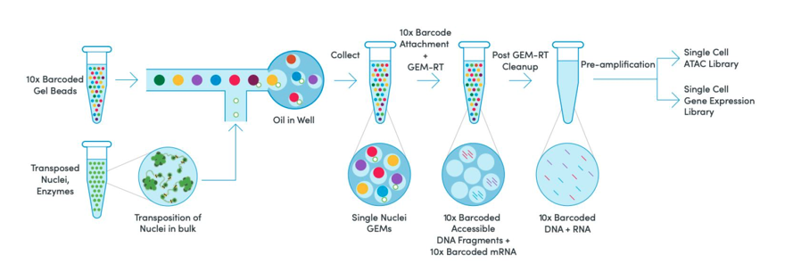
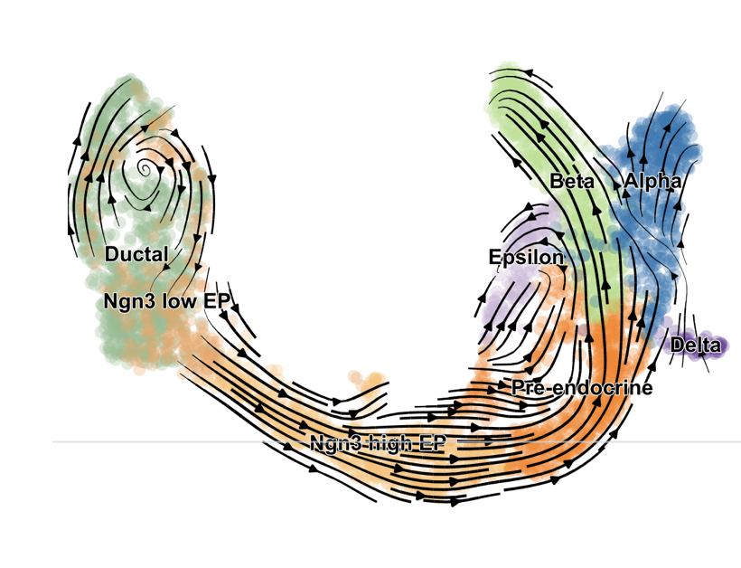
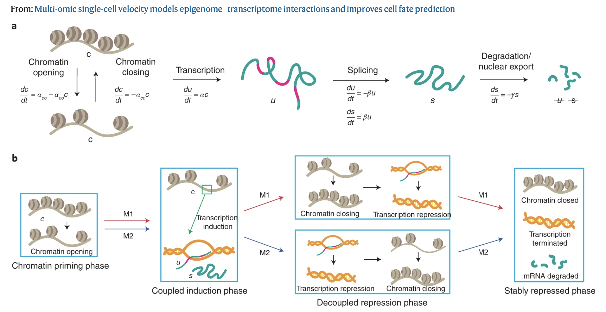
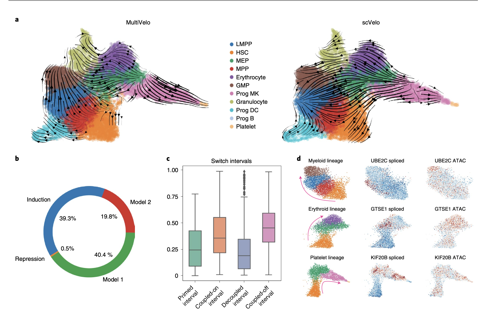

## TL;DR

Multiome data lets you simultaneously measure gene expression and open chromatin regions giving a glimpse of both *expression state* and *regulatory potential*. `Multivelo` lets you model the timing and dynamics between these two modalities, enabling you to move beyond a static snapshot and better infer regulatory dynamics.

## Introduction: What is Multiome?

Single cell RNA-Sequencing transformed the biological research landscape when it emerged. With the advent of high-throughput methods a few years later, finally researchers could probe hundreds to thousands of single-cell transcriptomes and move beyond the ambiguity of bulk tissues.

Around the time scRNA-Seq was becoming standardized and popular, [single-cell ATAC Seq ](https://pubmed.ncbi.nlm.nih.gov/26083756/)(Assay for transposase-accessible chromatin) hit the field. This advancement allowed researchers to elucidate the regulatory landscape of the genome (promoters, enhancers, transcription-factors, etc,) and infer regulatory potential versus activity. 

Sequencing cells for gene expression and another pool of cells for ATAC sequencing helped to improve cell type classifications and resolution, but the obvious limitation here is that you need *matched, but independent pools of cells*, otherwise, directly linking regulatory states and gene expression is *impossible*. This is where [10x multiome](https://www.10xgenomics.com/products/epi-multiome) changed the paradigm. A multiome assay enables the **simultaneous measurement** of gene expression and chromatin accessibility from the same single cell. 

By gleaning information from both assays from the same cell, multiome data enables a more complete view of cellular states by linking what *can* happen (chromatin accessibility) to what *is* happening (gene expression.) These *direct linkages* provide a powerful framework for asking more pointed questions that target causal and mechanistic insights: *how does the regulatory landscape interact with and affect gene expression to drive cells to different lineages?*

## From Snapshots to Dynamics

Single cell gene expression experiments are akin to a polaroid: they capture a static snapshot of expression profiles across cells. If RNA expression profiles are the developed image, the ATAC component is the camera settings behind it, the aperture and exposure that determines what *could* and *will* appear in the photo. But again, it is only a snapshot. While these snapshots can be highly informative, we know biology is highly dynamic (a blessing and a curse, truly). Typically, chromatin accessibility changes precede expression, meaning that ATAC can be a strong indicator of what the next gene expression snapshot could look like.

Moving beyond static snapshots to model cellular transitions is the next logical step. This is where *RNA velocity* comes in. RNA velocity attempts to answer a simple but complicated question: *given what we see in our snapshot right now, where is this cell going next?* If we think about our own camera rolls, we might have a string of photos taken in succession that tell a rough story, but without a video, we might not see or hear the full context behind these images (what happened directly before, or after the photo was taken.) Based on context clues in the photo, we can most likely infer what the context is, similarly, by modeling the ratio of unspliced to spliced RNA with tools like [`velocyto`](https://github.com/velocyto-team/velocyto.py) and [`scVelo`](https://github.com/theislab/scvelo) we can roughly see what genes are being turned on or off.

- High unspliced / low spliced: Gene is being *turned on*

- Balanced: Gene is in a steady state

- Low unspliced / high spliced: Gene is being *turned off*

This is a gross oversimplification. When we pass these ratios to RNA velocity tools like `scVelo`, under the hood it is fitting dynamical models that estimate transcription rate, splicing rates, and degradation rates. All this culminates in *velocity vectors* which represent the predicted future transcriptional state. By overlaying these vectors onto our UMAPs, we can roughly see cell state transitions across clusters. Below is an example UMAP pulled from the [`scVelo` publication](https://www.nature.com/articles/s41587-020-0591-3) highlighting velocities involved in pancreatic endocrinogenesis.

RNA velocity gives us a powerful way to infer directionality, but it is fundamentally limited to only one piece of the puzzle. We only account for transcriptional dynamics, which ignores regulatory priming and lag structure in chromatin dynamics. With multiome data, we can begin to explain *why* changes are happening. If RNA velocity gives us direction, the next question becomes: what is driving that direction? How can we infer what happens *before* and *after* our snapshot by leveraging the ATAC modality? `MultiVelo` fills this niche!

## Modeling Joint Dynamics with MultiVelo

[`MultiVelo`](https://github.com/welch-lab/MultiVelo) extends the `scVelo` framework by incorporating additional features into the dynamical model: the rates of chromatin opening and chromatin closing. In doing so, we take a step back and instead ask *is the gene even in a regulatory state that permits transcription?*

Rather than treating RNA and ATAC as independent modalities, `MultiVelo` explicitly models the temporal ordering between them by introducing the idea that each gene moves through a series of coordinated states. 

1. **Chromatin closed:** the gene is inaccessible and transcription if effectively off.

2. **Chromatin opening (primed):** regulatory regions become accessible, enabling transcription to begin.

3. **Active transcription (coupled-on):** Unspliced and spliced RNA accumulate.

4. **Chromatin closing (coupled-off):** accessibility decreases, and transcription slows or stops.

Additionally, `MultiVelo` separates genes into two distinct models of how chromatin accessibility relates to gene expression over time. 

- **Model 1 (M1) Genes:** Chromatin closes *before* RNA decreases. In this model, the chromatin opens allowing transcription to start. RNA accumulates, the chromatin begins to close, and RNA levels begin to decrease as accessibility decreases. 

- **Model 2 (M2) Genes:** Chromatin closes *after* RNA decreases. In this model, the chromatin opens, transcription starts, RNA levels begin to decrease and the chromatin closes later. Biologically, this could indicate that the gene is still accessible, but being downregulated by other mechanisms. 

Comparing these two models allows us to get a pretty decent representation of the regulatory dynamics at play. M1 genes are tightly controlled at the chromatin level, while M2 genes are regulated *beyond* accessibility (eg. through transcription factor availability or repression.) By explicitly accounting for these changes, we are able to capture the chromatin changes that often precede transcription: changes that represent a *primed* state that RNA-only methods cannot capture. This helps us with tasks like lineage direction refinement, identifying regulatory drivers, and separating out genes that determine early or late stages of differentiation. 

## MultiVelo In Practice: Early Blood Development in Humans

Blood development exists on a rapid continuum with many transient and highly plastic cell states that can diverge into multiple different lineages, making this system complex and difficult to accurately untangle. Thinking of our polaroid analogy, this is akin to that one blurry photo you have of your friend group, everyone is moving, and no single moment clearly captures what’s happening.

In this particular system, RNA velocity alone often struggles to recapitulate the true hematopoietic hierarchy, sometimes causing misleading or biologically inconsistent results. In the [`MultiVelo` publication](https://www.nature.com/articles/s41587-022-01476-y), authors applied the algorithm to human hematopoietic progenitors (HSPCs) acquired from multiome sequencing. 

Results show that Incorporating chromatin accessibility into velocity calculations markedly improves the biological accuracy of inferred differentiation trajectories compared to RNA alone. Many genes showed evidence of regulatory priming, including terminal cell type-specific markers such as *HBD* in erythrocytes. Beyond priming, `MultiVelo` also reveals distinct regulatory programs across genes. In this dataset, genes following Model 2 (M2) dynamics (chromatin accessibility lags behind changes in expression) were significantly enriched for cell cycle–related processes. This suggests that for these genes, regulation is not driven purely by chromatin accessibility, but instead reflects additional layers of control, such as cell cycle progression. Notably, many G2/M phase markers exhibit this pattern, with chromatin remaining accessible even as transcription begins to decline. This reinforces the idea that not all genes are regulated equally: some are tightly controlled at the chromatin level (M1), others reflect downstream processes like the cell cycle that operate on different regulatory timescales. Unsurprisingly, mature cell type populations tend toward velocities near zero (steady state), whereas progenitor populations retain high velocity, reflecting their greater potential to transition between states. Together, these results highlight how incorporating chromatin information not only improves trajectory inference, but also reveals the regulatory timing that drives cell fate decisions.

## Closing Thoughts

Single cell genomics has taken us from bulk averages to high resolution snapshots of cellular identity. Multiome data pushes this even further, linking gene expression to the regulatory landscape that enables it. But biology is not static, it is a continuous process of change.

As multiomic technologies continue to evolve, integrating modalities will become less of a novelty and more of a necessity. The real power lies not just in measuring more data, but in connecting layers of biology to uncover the mechanisms that drive cellular behavior. We’re no longer just taking snapshots, we’re starting to piece the movie together, frame by frame.

As an informal aside, my next plans include using the pseudotime output from multivelo as input for [`CellRank2`](https://github.com/scverse/cellrank) to determine biases in differentiation trajectories between two distinct progenitor populations...perhaps this will be a future blog post, so stay tuned! In the meantime, **compute and conquer!**

## Citations

Bergen, V., Lange, M., Peidli, S. et al. Generalizing RNA velocity to transient cell states through dynamical modeling. Nat Biotechnol 38, 1408–1414 (2020). https://doi.org/10.1038/s41587-020-0591-3

Buenrostro JD, Wu B, Litzenburger UM, Ruff D, Gonzales ML, Snyder MP, Chang HY, Greenleaf WJ. Single-cell chromatin accessibility reveals principles of regulatory variation. Nature. 2015 Jul 23;523(7561):486-90. doi: 10.1038/nature14590. Epub 2015 Jun 17. PMID: 26083756; PMCID: PMC4685948.

Butler, A., Hoffman, P., Smibert, P. et al. Integrating single-cell transcriptomic data across different conditions, technologies, and species. Nat Biotechnol 36, 411–420 (2018). https://doi.org/10.1038/nbt.4096

La Manno, G., Soldatov, R., Zeisel, A. et al. RNA velocity of single cells. Nature 560, 494–498 (2018). https://doi.org/10.1038/s41586-018-0414-6

Li, C., Virgilio, M.C., Collins, K.L. et al. Multi-omic single-cell velocity models epigenome–transcriptome interactions and improves cell fate prediction. Nat Biotechnol 41, 387–398 (2023). https://doi.org/10.1038/s41587-022-01476-y

Stuart, T., Srivastava, A., Madad, S. et al. Single-cell chromatin state analysis with Signac. Nat Methods 18, 1333–1341 (2021). https://doi.org/10.1038/s41592-021-01282-5

Weiler, P., Lange, M., Klein, M. et al. CellRank 2: unified fate mapping in multiview single-cell data. Nat Methods 21, 1196–1205 (2024). https://doi.org/10.1038/s41592-024-02303-9

https://www.uth.edu/cgc/sequencing-service/multiome

https://www.10xgenomics.com/products/epi-multiome