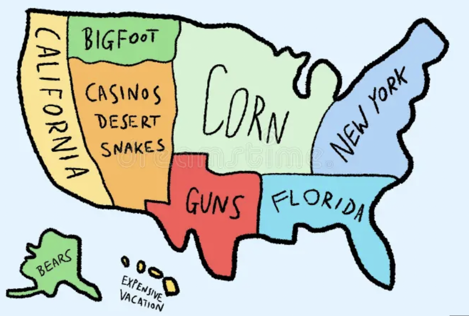
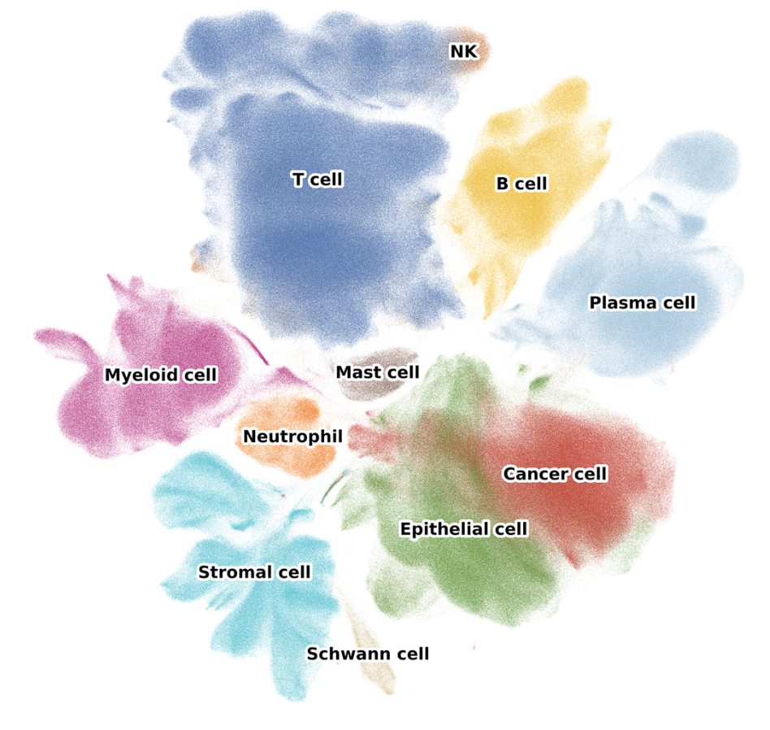

## TL;DR

UMAPs are perhaps the easiest way of gaslighting yourself (now with pretty color palettes and new and exciting shapes!) Interpret with caution and avoid the pitfalls of non-linear reductions! 

## Introduction

UMAP plots...the "abstract art" of the high-dimensional genomic data world. There is nothing more satisfying than generating that first UMAP embedding for your single cell data. It's the moment you can finally *see* how your data looks. The nice geometric shapes and colorful clusters immediately trigger the pattern-seeking parts of our brains! 

Looking at a UMAP is fun. Interpreting them is where things can become dangerous. 

## The Elephant...
Chari and Pachter in their [2023 PLOS Computational Biology](https://www.biorxiv.org/content/10.1101/2024.03.26.586728v1#ref-3) paper claimed that UMAP (and the earlier t-SNE counterparts) are highly unstable, sensitive to hyper-parameters, and prone to over-interpretation. They go as far as to compare these particular embeddings to "forcing the data into the shape of an elephant." Thanks to those aforementioned pattern-seeking parts of our brain, we as humans are really good at seeing structure in data even when the geometry underneath it might not faithfully represent it. 

However, the story didn't end there. This paper was rebutted by [Lause et al., 2024](https://journals.plos.org/ploscompbiol/article?id=10.1371/journal.pcbi.1012403) which showed that these methods do a pretty great job afterall. So what is the issue? UMAPs are *really* easy to misinterpret. 

## What is UMAP

UMAP stands for *uniform manifold approximation and projection*, introduced by [McInnes, Healy, and Melville 2018](https://arxiv.org/abs/1802.03426). Prior to UMAPs ubiquity in single-cell analyses, t-distributed stochastic neighbor embedding (tSNE) was the gold-standard for single-cell and cyTOF datasets. 

Both of these methods are nonlinear dimensionality reduction techniques that compress high-dimensional data into 2 or 3-dimensional planes for visualization. The resulting coordinates are known as *embeddings*. 

While the underlying Riemannian geometry and algebraic topology behind UMAP calculations is far beyond the scope of this blog, it can be boiled down into two simple steps:

1. UMAP learns an embedding based on a nearest-neighbor graph in high-dimensional space

2. A low-dimensional layout is optimized such that neighborhood relationships are retained as closely as possible. 

That can be a lot to digest at first, so let's take a step back and explain *how* this works in practice. 

## A Social Network Analogy
Think of a UMAP (and the underlying neighborhoods) as your social network. The local structure of your network might encompass your closest friends and family members. However, the global structure are the handful of people you know from high school that you havent spoken to in 12 years and all the mutual friends you kinda/sorta know. A UMAP of your social network would put you and your inner circle tightly clustered. All those distance acquaintances...they'd be somewhere else on the plot. Maybe far away, but their exact distance from you is totally meaningless. That distinction, preserving local neighborhoods while sacrificing precise global distances, is one of the most *crucial* concepts in UMAP topology interpretation. 

In the context of single-cell, these networks represent the cells in our dataset. Clusters of cells identified by clustering algorithms like Leiden or Louvain clustering often represent distinct cell types or states which we can label through processes like marker gene analysis, reference label transfer, or automatic cell-typing algorithms. 

## The Dangers of Over-interpreting a UMAP

UMAP certainly excels at preserving *local neighborhoods*, but comes at the cost of faithfully preserving global geometry. As a result, distances between distant clusters should generally *not* be interpreted quantitatively. Other linear methods like principal component analysis (PCA) are often much better at preserving broader global variance structure, but they have a much harder time separating the data into fine-grained clusters in the same way UMAP does. 

The 2026 paper [Demystifying UMAP artifacts: an interactive study on diagnosis and steering using 3D probes](https://journals.sagepub.com/doi/full/10.1177/14738716261434908?) coins the term "cartographic fallacy". In simple terms, we *assume* embedding layouts are an accurate map of the underlying data. When we see anomalies in these embeddings (i.e., a celltype of interest clusters far away from all other cell types), we might think that something really interesting is going on. Perhaps we might think we just discovered a new T-cell subtype. In reality though, we are really just observing algorithmic "side-effects" of stochastic optimization steps. 

UMAP embeddings are sensitive to many things. One small change of processing in your pipeline can lead to very different results. These include:

- **Preprocessing choices:** This includes anything from filtering, normalization, regression strategies, number of variable features used for PCA, number of principal components retained, the quality of those PCs, etc. can all dramatically alter UMAP results. Essentially, UMAP is partly a visualization of the features you choose to emphasize.

- **Data integration procedures:** When batch effects are present, we often choose to integrate data better capture the underlying biology. UMAP does not operate on raw expression matrices, but rather on processed representations such as PCs, latent variables, or integrated neighbor graphs. Because different integration methods correct batch efects with varying levels of aggressiveness, they can substantially reshape the resulting embedding. In some cases, a UMAP may appear beautifully mixed and visually smooth while masking or distorting *real* biological variation.

- **Number of neighbors:** This is one of the two key UMAP parameters. `n_neighbors` controls the balance between local and global structure such that smaller values emphasize tiny local clusters, often producing fragmented islands, while larger values produce a smoother manifold that better preserves broader relationships. That means that tweaks to this parameter make the same data look highly discrete, or like a continuous trajectory. 

- **Minimum distance:** This is the second key parameter. `min_dist` controls how tightly clusters pack together such that lower values tightly compress clusters with an exaggerated separation while higher values create more diffuse clusters with smoother transitions. These two parameters in conjunction are often used to modify visual aesthetics and apparent cluster discreteness. 

- **Random Seeds:** Since UMAP is a stochastic optimization process, chancing your random seed with `set.seed()` will alter your results. As such, it is good practice to always set a seed!

## How to Safely Use UMAPs

Despite these warnings, UMAP remains an invaluable tool for single-cell analysis when used appropriately. UMAPs are great for exploratory data visualizations. It is that crucial first look at your data. Use it to spot major cell populations, identify if your samples are mixing or showing evidence of strong batch effect (this informs whether integration is right for your data or not). Using marker gene expression levels, you can use UMAPs to identify clusters of potential doublets (i.e., visualizing incompatible markers for shared expression). Annotating QC features on UMAPs can also help to identify clusters of low-quality cells. If cells cluster together in your UMAP they likely *are* transcriptionally similar since the local structure is well preserved. 

UMAPs can also be used for trajectory analyses, however, just because cells form a visual continuum in your UMAP doesnt mean they represent a true biological developmental trajectory. Dedicated trajectory inference methods can help untangle this with more nuance. 

When using UMAPs be sure to follow these general guidelines:

- Always use a set seed. 
- Always report hyper-parameters, if they are adjusted from the defaults. 
- Always test multiple parameter settings and document every step of your preprocessing pipeline **in detail.** 
- Consider including complementary visualizations to supplement any hypotheses or conclusions, such as the associated PCA plot. If these tell dramatically different stories, investigate why. 
- Focus on intra-cluster patterns by asking, *what cells cluster together* instead of *how far apart are these clusters?* 
- **Always** validate everything with marker genes or differential expression results. Be honest about uncertainty. 
- **Never** base biological conclusions solely on UMAP distances. 

**❌ Don't say:** "These clusters are close together, suggesting shared developmental origins"  
**✅ Instead say:** "These populations share expression of marker genes X, Y, Z"

**❌ Don't say:** "Cluster A is more related to B than C based on proximity"  
**✅ Instead say:** "Pseudotime analysis suggests cluster A differentiates toward B"

**❌ Don't say:** "The large size of this cluster indicates high heterogeneity"  
**✅ Instead say:** "This population contains X cells and shows variable expression of..."

## Conclusion: UMAP is a Tool, Not a Microscope

UMAP is not looking *at* your cells; it's creating a *representation* of them optimized for human visual pattern recognition. It's more like an artist's interpretation than a photograph.

This doesn't make UMAP useless. Far from it, actually. A skilled artist can capture essential truths that a photograph might miss. But you wouldn't measure the actual distance between two mountains using a watercolor landscape, and you shouldn't measure biological relationships using UMAP coordinates.

The single-cell field has grown explosively, and UMAP has become so ubiquitous that it's easy to forget it's a visualization technique with specific assumptions and trade-offs. We've collectively developed a kind of "UMAP literacy" problem: we can all make the plots, but we're not all reading them correctly.

So the next time you're about to write "the proximity of these clusters suggests," stop. Ask yourself: Am I interpreting local structure (which UMAP preserves) or global distance (which it doesn't)? Am I using this to explore or to conclude? Am I validating this with something beyond the pretty picture?

UMAP plots are beautiful, useful, and powerful. They're also easy to misinterpret, parameter-sensitive, and fundamentally distorted. Embrace the contradiction. Use them wisely.

Your cells—and your readers—will thank you. **Compute and Conquer**

## References

- Chari, T., & Pachter, L. (2023). The specious art of single-cell genomics. *PLOS Computational Biology*, 19(8), e1011288. https://doi.org/10.1371/journal.pcbi.1011288

- Lause, J., Kobak, D., & Berens, P. (2024). The art of seeing the elephant in the room: 2D embeddings of single-cell data do make sense. *PLOS Computational Biology*, 20(10), e1012403. https://doi.org/10.1371/journal.pcbi.1012403

- McInnes, L., Healy, J., & Melville, J. (2018). UMAP: Uniform Manifold Approximation and Projection for dimension reduction. *arXiv preprint* arXiv:1802.03426. https://arxiv.org/abs/1802.03426

## Further Reading

- [Understanding UMAP](https://pair-code.github.io/understanding-umap/) - Interactive visual explanation
- [Orchestrating Single-Cell Analysis with Bioconductor](https://bioconductor.org/books/release/OSCA/) - Chapter 4 on dimensionality reduction
- [UMAP Documentation](https://umap-learn.readthedocs.io/) - Official documentation with parameter guides

