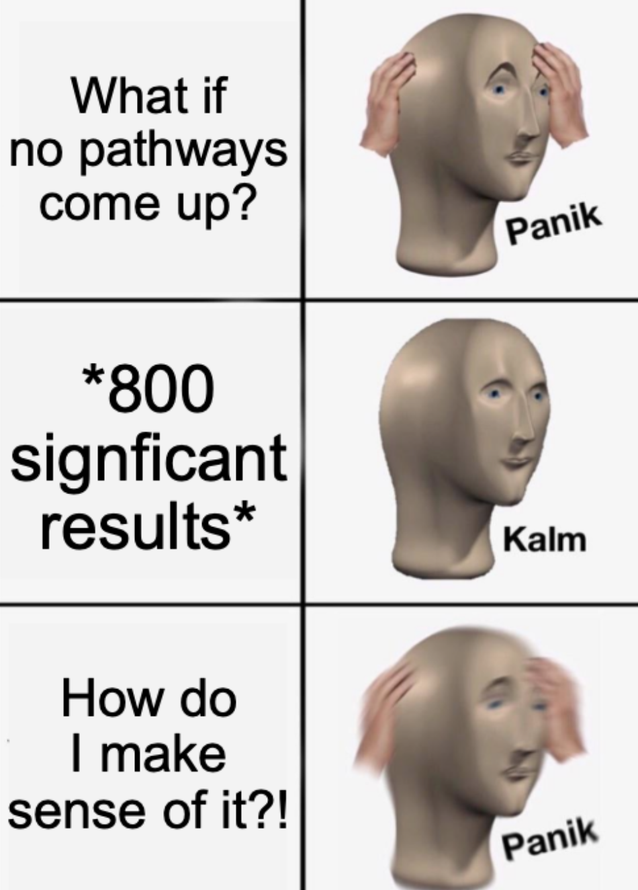
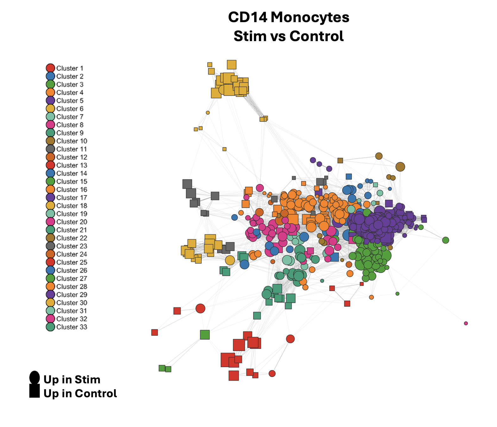

## TL;DR

This post walks through a network-based approach for single-cell pathway analysis that reframes the question *which pathways are significant* to *how many distinct biological programs are active and how are they organized?* A Jaccard similarity based network built on differentially expressed genes and over-representation analysis results transforms how you view and interpret your results. I demonstrate the utility of this type of analysis on a public PBMC dataset (IFN from `SeuratData`). 

Thank you to Dr. Owen Wilkins for showing me this methodology!

[Click here for code](https://github.com/mikemartinez99/IFNB_GO_Networks)

  

  <h2>Table of Contents</h2>

  <ol>
    <li><a href="#introduction">Introduction</a></li>
    <li><a href="#how-it-works">How it Works</a></li>
    <li><a href="#go-ora-networks-in-practice">GO-ORA Networks in Practice</a></li>
    <li><a href="#biological-context">Biological Context</a></li>
    <li><a href="#results">Results</a></li>
    <li><a href="#conclusion">Conclusion</a></li>
    <li><a href="#citations">Citations</a></li>
  </ol>

## Introduction

Ask any computational biologist what comes after differential expression analysis. I guarantee most will answer with some form or another of pathway analysis (over-representation analysis, GSEA, GSVA, etc.) It's a routine procedure that is seemingly ubiquitous in the world of transcriptomics analysis both at the bulk and single cell level. Personally, one of the pain-points of analyzing pathway enrichment data is sifting through hundreds of redundant gene ontology (GO) terms and setting more-or-less arbitrary cutoffs for visualization(s) of results (unless of course you have some *a priori* knowledge of what pathways you are expecting). The "tried and true" dotplots we often see in papers are nice and have stood the test of time, but they quickly become hard to read when you have a lot of terms. It is easy to lose sight of the big picture this way. 

Recently, I had the opportunity to work on a late-stage single-cell omics project looking at over-representation results across different celltype sub-clusters. The analysis my supervisor and I undertook fundamentally changed how I think of pathway analysis. Reframing the question from "*what pathways are significantly enriched*, to *how many distinct biological programs are active, and how are they organized*" helped us to drill down the most relevant biological signals in the data. The secret is moving from large tabular dataframes and dotplots to *networks.*

## How it Works

**Differential Expression:** For each cell type annotation, Seurat's `FindMarkers` is called specifying `ident.1` and `ident.2` as your comparison groups of interest. This produces a list of differential expression results. 

**Gene ontology over-representation Analysis (GO-ORA):** The differential expression list is passed to ClusterProfiler's `enrichGO` function. This tests whether GO biological processes (or cellular components/molecular functions) are statistically over-represented among your differentially expressed genes compared to the background list genes (i.e., all genes present in the initial Seurat object). The output for each celltype is an `enrichResult` object.

**Network analysis:** Here is where things get interesting, so i'll break it down in greater detail.

1.  We can build a network structure using the differential expression results per celltype along with their corresponding GO-ORA results. We start by filtering GO-ORA results to those that pass false-discovery rate (FDR) correction at 0.05. Next for each surviving GO term, we split the enriched genes present in the term into a named list, such that each list element is the vector of differentially expressed genes annotated to that term. 

2. Next, we calculate a pathway-level log2 fold-change. For each GO term, we take the intersection of its gene members with the differential expression results. For genes in this intersection, we extract the log2 fold-changes and average them. This number is then used downstream to designate a pathway as up or down-regulated. 

3. Now that we have some basic pathway-level statistics, we can compute the Jaccard similarity matrix. This is the **core of the network construction**. Every GO term is compared to every other GO term in a pairwise manner. For terms `i` and `j`, the edge weight is the *Jaccard index, defined as:*

<code>Jaccard(i,j) = |genes(i) ∩ genes(j)| / |genes(i) ∪ genes(j)|</code>

Jaccard indices range from 0 (no shared genes) to 1 (fully identical gene sets). This captures something *real* about GO structure: redundant terms share nearly all their genes and will thus have higher Jaccard similarities. Conversely, highly dissimilar terms will have lower Jaccard similarities. The result here is a symmetric adjacency matrix where non-zero entries become edges. We can then use igraph's `graph_from_adjacent_matrix` function to convert the matrix into an undirected weighted graph. Using the metrics we calculated earlier, we can then render a network where nodes are shaped based on their up or down-regulation (based on pathway average log2FC), and sized by the number of genes in the pathway. Node edge widths are then set to the Jaccard weight, so visually thicker edges indicate higher degree of overlap between pathways. 

4. Lastly, we can apply Leiden community detection to cluster networks into meaningful hubs and modules. Leiden is a graph partitioning algorithm that tries to find clusters where nodes are densly connected internally and sparsely connected externally. Once we assign clusters, we can then extract cluster-membership information to identify which GO terms fall into which clusters, along with their genes and statistics (i.e. average degree per cluster, number of terms per cluster), including network stats (average degree overall, number of nodes, number of edges, etc.)

## GO-ORA Networks in Practice

To demonstrate this analysis, I used the IFNB dataset from `SeuratData` (pulled from [Kang et al. 2018, *Nature Biotechnology*](https://www.nature.com/articles/nbt.4042)). This dataset contains ~14k human peripheral blood mononuclear cells (PBMCs) across 2 biological conditions, control and interferon-β stimulated (6 hours), across 8 donors. 13 annotated celltypes are present in this dataset, including: monocytes(CD14+ and CD16+), T Cells (CD4 Naive, CD4 memory, CD8 T, T-activated), natural killer cells, B cells, B-activated, plasmocytic dendritic cells, megakaryocytes, and erythrocytes. 

## Biological Context

Since IFN-β is a secreted cytokine that sits at the center of innate immune response programs, it's produced *rapidly* by virtually *any cell* that detects viral nucleic acids via pattern recognition receptors (PRRs). Once secreted, it acts in both an autocrine and paracrine fashion (i.e., interacting with the same cell that secreted it, or other cells) by binding the IFNAR1/IFNAR2 receptor complex. PBCMs are a mix of the major circulating immune cell types, each of which express the IFNAR complex. However, PBMCs respond very differently depending on their baseline transcriptional state and function. 

For this blog, I chose to focus my attention to CD14 monocytes, which are often the most abundant monocyte in blood. These cells are classical innate sentinels that highly express IFNAR constitutively, making them primed to respond. They are also major producers of inflammatory cytokines and upregulate antigen presenting machinery in response to IFN-β to prime adaptive immunity.

## Results

Differential expression analysis of this cluster identified 415 genes upregulated in the control group and 348 upregulated in the IFN-β stimulated group. Over-representation analysis tested 5115 GO-biological process terms, 541 of which were significant after FDR-correction (roughly 10%). Network construction and Jaccard thresholding (≥ 0.1) resulted in 540 non-singleton nodes across 33 clusters. 

The dominant module upregulated in IFN-β stim was cluster 3, which contains terms like *viral life cycle, defense response to virus, type I interferon mediated signaling* and *interferon-beta production*, all pointing to a canonical **antiviral / Type I interferon response**. Driving genes in this cluster included core interferon-stimulated gene programs activated downstream of JAK-STAT through IFNAR, in-line with biological expectations. 

Modules upregulated in the control group are also informative, as these are essentially *downregulated* in the IFN-β stimulated group. Cluster 6 and cluster 1 showed signatures indicative of *oxidative phosphorylation, ATP synthesis, ribosomal biogenesis*, and *cytoplasmic translation.* This indicates that treatment with IFN-β shifts cellular priorities in CD14 monocytes away from metabolic and translational programs. This shutdown is a hallmark of type I interferon signaling. 

Taken together, the network clearly recapitulates the known biology of IFN-β stimulation in CD14 monocytes: a strong antiviral transcriptional program switches on while energy-intensive housekeeping functions are dialed back. Importantly, **this interpretation emerged from the network structure itself, not from manually curating a list of terms or setting arbitrary significance cutoffs.** The 541 significant GO terms collapsed into 33 interpretable clusters, transforming an otherwise unwieldy results table into a coherent biological story.

## Conclusion

It is worth noting that "interesting" clusters can be determined a number of ways. For example, using cluster statistics and network statistics in conjunction we can identify which clusters have the highest average degree. This indicates clusters that are highly dense and connected. We can also look at clusters with the most or least number of terms to identify broad or niche programs, respectively. It also also worth mentioning that this methodology is not limited to just single-cell. Applying these networks will also work with bulk RNA data as well. 

While this analysis is by no means comprehensive, it serves to demonstrate the utility of analyzing pathway enrichment data in this way. This is definitely a technique i'm keeping in my back pocket from now on. I highly recommend you give it a try in your next analysis. I have a package in development to facilitate this analysis 👀 so stay tuned (currently named GDSCtools...you'll see it in the code.) Until then: *Compute and Conquer!*

**Acronyms / Abbreviations Used in this Blog:**

| Acronym | Definition |
|---|---|
| GO | Gene Ontology |
| ORA | Over-Representation Analysis |
| GSEA | Gene Set Enrichment Analysis |
| GSVA | Gene Set Variation Analysis |
| DE | Differential Expression |
| FDR | False Discovery Rate |
| FC | Fold Change |
| PBMC | Peripheral Blood Mononuclear Cell |
| IFN-β | Interferon-beta |
| PRR | Pattern Recognition Receptor |
| IFNAR | Interferon-alpha/beta Receptor |
| JAK-STAT | Janus Kinase – Signal Transducer and Activator of Transcription |
| ATP | Adenosine Triphosphate |

## Citations

Kang, H.M., Subramaniam, M., Targ, S., Nguyen, M., Maliskova, L., McCarthy, E., Wan, E., Wong, S., Byrnes, L., Martin, C.S., and Ye, C.J. (2018). Multiplexed droplet single-cell RNA-sequencing using natural genetic variation. Nature Biotechnology, 36(1), 89–94. https://doi.org/10.1038/nbt.4042

