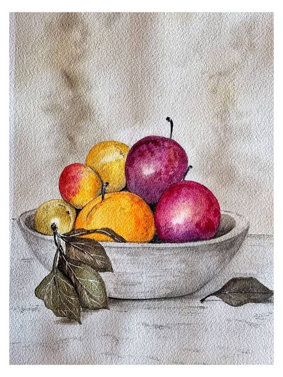
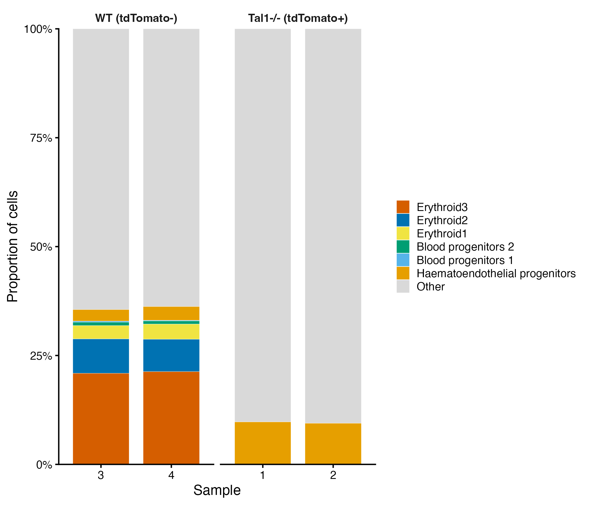
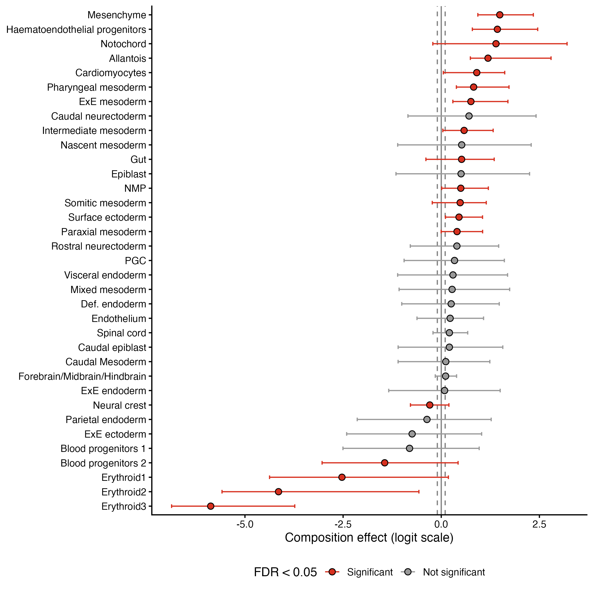

## TL;DR

Single-cell data is compositional, and this comes with challenges. Traditional differential expression doesn't tell you if cell type populations expand or deplete. To tap into that question, we need differential abundance analysis. sccomp is a Bayesian method to tackle compositionality. We try it out on some real-world data!

## The Compositionality Problem

Imagine a bowl of fruit...

In this bowl, we have 5 apples and 5 oranges. 10 pieces of fruit total. An even 50/50 split. As is appropriate for fall, we go apple picking and add 5 more apples to our bowl. So, we've shifted our fruit proportions in favor of apples. We *could* say that the proportion of oranges in our bowl decreased...and this would be true. But we didn't eat any oranges. We simply just added more apples.

Herein lies the great omics problem of *compositionality.* Let's reframe fruit as single-cells. 

Perhaps your lab studies a drug that does *something* (as most hopefully do...). You could look at differential expression (DE) to ask *how is gene expression changing when I treat cells with this drug?* That's a great question to ask, and a very important one too. This informs you if your treatment targets the correct genes/pathways to elicit a biological effect. But let's say you expect your treatment to perturb the overall cell type compositions. How can we assess this question? Differential expression alone can't answer this. We need to turn to it's often overlooked and under-utilized cousin, differential abundance (DA) analysis. 

BUT (there's always a but...), differential abundance analysis is not as clear-cut as differential expression analysis is. It comes with unique challenges that many labs and tools strive to tackle. Any data that is inherently compositional (metagenomics, flow-cytometry, single-cell, etc..) has the same issue as our fruit bowl: 

*We can't always tell if a reduction in one population is a true depletion, or merely a byproduct of the expansion of another population.*

Let's remember that in single-cell sequencing, our cell type populations (i.e., our clusters which could represent anything from defined cell types to activation states), are *representative proportions of the number of total cells sequenced for that sample.* This total cell count essentially is a scaling factor.

## Why Not Just Use a T-Test?

You might think, "well, I can just group my replicates and compare each celltypes proportion with a simple T-test!"

If you have replicates, A+ for you. (Seriously, *please* include replicates in your single-cell data where possible. Your bioinformatics collaborators will thank you.)

However, thinking you can get away with a T-test and get past reviewer #2...good luck. 

A T-test would assume each cell type is independent (which, as we've made clear now, they're not.) Proportions are linked (think back to our fruit bowl.) The second problem is that once you convert your cell types to proportions, T-test comparisons are not fairly comparable. 2 out of 50 cells and 200 out of 5,000 are both 4%. A fluctuation in a rare population moves on a much greater scale than one in a large population, which can greatly skew results. This also ties into the shape of data that a T-test expects. Proportions are bounded between 0 and 1, and won't follow a normal distribution, especially rarer cell types. We can go on and on about the many reasons why this is *not* the correct statistical approach to take. 

## sccomp 

Differential abundance is far from a neglected-problem. The field has produced a litany of tools from counts-based models like edgeR, proportion-based approached like propeller, compositional Bayesian approaches like scCODA, and a cell type hierarchy-aware variant, tascCODA, cluster-free methods like Milo....the list goes on. For the purposes of this blog, I wanted to highlight [sccomp](https://github.com/MangiolaLaboratory/sccomp) *(Mangiola et al., PNAS 2023)* which is a tool I recently got to use for a project. 

In one sentence: *sccomp is a Bayesian framework to estimate compositionality effects, variance effects, or both!*

This method operates under a few assumptions:

1: **cell type proportions depend on one another and always sum to 1.**

As mentioned, each sample gives a fixed number of captured cells. If we analyze each cell type alone (i.e., as if we did a T-test on a single cell type across samples), we might misinterpret a result as a depletion, when in reality, it's a result of the expansion of a different population.

2: **Rare cell types are noiser.**

Some cell type proportions are steadier across replicates. Populations that are expected to be smaller (i.e., pDCs or mast cells) often vary a lot sample-to-sample. sccomp uses this to help define some variability. If you've used DESeq2 before, this is a similar concept to sharing information across genes. 

3: **Outlier samples are common.**

If T-cells are pretty stable across 2 out of 3 replicates, but the third has a wildly different proportion, this effect might be enough to artificially show a true differential abundance. sccomp takes this into account and checks each cell type-by-sample against what the rest of the data predicts. If one cell type in a particular sample is an obvious outlier, you can choose to drop it!

## A Crash Course on How it Works

I'll preface this section with this: *I'm not a statistician!*

For a more rigorous explanation of the cool maths, check out the [sccomp methods paper](https://www.pnas.org/doi/10.1073/pnas.2203828120).

Each cell type's count is modelled by taking into account theres noise in how often cell types get drawn and also noise between samples. The fancy stats term for this is as a beta-binomial distribution.

Next, mean proportions of cell types are constrained to sum to 1. Each cell type then receives a variability value, which are then pulled toward a shared trend (if you've ever used a shrinkage procedure in differential expression analysis, this is the same thing.)Low variability means the cell type is pretty consistent between samples, and vice-versa.

Conditional effects (or variability effect, or both) are regressed on a log-odds (logit) scale and fit with a Bayesian model. The logit scale stretches [0,1] bounded proportions onto an open-ended scale so they can be compared fairly. This model is then used to flag and remove any individual outlying counts before the final test.

Since sccomp is a Bayesian method, the returned results can be a little overwhelming if you're more accustomed to frequentist statistics (i.e., a fold change and a p-value.) What you get back instead are:

- *the effect:* Rather than a single best estimate, you get a posterior distribution, i.e., a thousands of plausible values for each parameter. The effect is the average of these values.

- *95% credible interval:* this is the range containing 95% of the plausible values. You can read this as "there's a 95% chance a true effect is in this range, given the modelled data.*

- *pH0:* The probability that the effect is negligible. A low pH0 means the model is confident there is a real change. This is **not** a p-value. A p-value asks how surprising the data would be if there were no effect while pH0 is the probability of no meaningful effect.

- *FDR:* The false-discovery rate, which is build from the pH0 values, calculated as the running mean of the cell types, ranked from most to least confident. 

## A real world example

Let's work through an example from the paper [*A single-cell molecular map of mouse gastrulation and early organogenesis.*](https://www.nature.com/articles/s41586-019-0933-9)

**This is not a comprehensive analysis, simply a quick demo!**

The code for this example can be found on [my GitHub](https://github.com/mikemartinez99/sccomp_Demo)

Here, the authors sequenced single-cells from mouse embryos sampled every 6 hours from E6.5 to E8.5, which encompasses the gastrulation period (the embryo goes from a simple layer of cells to the beginnings of every major organ system.) These data were used to build an atlas of cell types and the developmental paths between them. To demonstrate the utility of this atlas, they created chimeric embryos by injecting tomato-labelled stem cells into host embryos. One such chimera was one where cells lacked *Tal1*, a gene essential for blood formation. The tomato-chimera then allowed them to observe which blood and endothelial lineages failed. 

The paper reports that *Tal1⁻/⁻ tdTomato⁺* cells did not contribute to blood lineages, as confirmed by flow-cytometry and single-cell mapping. There was a complete loss of classic haematopoietic markers *Cd41* and *Cd45*. Additionally, there was also a complete loss of *Cd71⁺Ter119⁺* erythroid cells in the *tdTomato⁺* cells. While this paper did not formally test differential abundance, the results we obtained in our small demonstration match this trend. 

Here we have 2 wildtype (WT) samples versus 2 *Tal1⁻/⁻ tdTomato⁺* samples (all at E8.5). 

  

  

1. Erythroid 1, 2, and 3 clusters had a strong negative compositional effect, indicating (essentially) their near-complete ablation in the *Tal1⁻/⁻* cells. Erythroid cells occupy a much larger share of the total number of cells in the wildtype (WT) samples, simply because these cells are gone in the knockout samples. 

2. Blood progenitors 2 showed the same trend. Blood progenitors 1 narrowly missed the FDR threshold, despite having zero cells in both knockout samples. The weaker estimate reflects small cell numbers and only two replicates per group.

3. On the other end, hematoendothelial progenitors accumulate in the *Tal1⁻/⁻* cells. This is one of the earliest endothelial subclusters. Basically, cells become blocked at an early endothelial progenitor state rather than becoming various blood cells when *Tal1* is knocked-out.

## Conclusion

Thinking back to our fruit bowl...we saw the same effect in our *Tal1⁻/⁻* data. When cells fail to make blood, a huge amount of the cells present in our WT data simply vanished. With all this "empty space", it looked as though other celltypes had expanded, when in reality...most of them didn't really change. 

So next time you stare at your cluster compositions across groups and think "wow, thats a big difference", think about your apples and oranges. 

## Citations

Mangiola S, et al. (2023). sccomp: Robust differential composition and variability analysis for single-cell data. PNAS 120(33), e2203828120. doi:10.1073/pnas.2203828120

Pijuan-Sala B, et al. (2019). A single-cell molecular map of mouse gastrulation and early organogenesis. Nature 566, 490–495. doi:10.1038/s41586-019-0933-9

